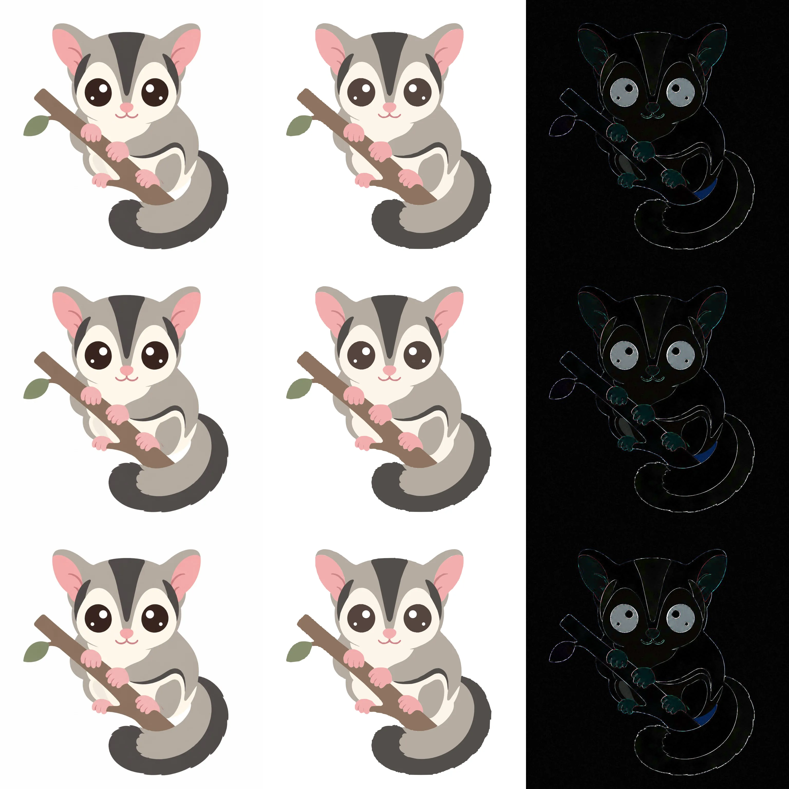

# raster-to-vector

**English** | [日本語](README.ja.md) | [中文](README.zh.md)

[](https://github.com/ozekimasaki/raster-to-vector/actions/workflows/validate.yml)
[](LICENSE)
[](https://agentskills.io/specification)

Raster → editable SVG. WVR / CFV-X. Input: PNG / JPEG / WebP.

## Install

```text
npx skills add ozekimasaki/raster-to-vector
```

| Target | Command |
|---|---|
| Cursor | `npx skills add ozekimasaki/raster-to-vector -g -a cursor -y` |
| Claude Code | `npx skills add ozekimasaki/raster-to-vector -g -a claude-code -y` |
| Codex | `npx skills add ozekimasaki/raster-to-vector -g -a codex -y` |
| List | `npx skills add ozekimasaki/raster-to-vector --list` |

| Environment | Path |
|---|---|
| Cursor | `~/.cursor/skills/raster-to-vector/` |
| Claude Code | `~/.claude/skills/raster-to-vector/` or `.claude/skills/` |
| Codex | `~/.codex/skills/raster-to-vector/` |
| claude.ai | ZIP with this folder at the root |

## Requirements

| Use | File |
|---|---|
| Python | 3.10+ |
| Core measurement | `requirements-core.txt` |
| Render comparison | `requirements-render.txt` |
| CFV-X / mosaic-draft curve | `requirements-cfvx.txt` |

```text
python -m venv .venv
.venv/Scripts/python -m pip install -r requirements-render.txt
```

If Chromium is elsewhere, set `CHROMIUM_PATH`.

## Usage

```text
Convert this image to SVG
```

`SKILL_ROOT` = absolute path of this directory.

```text
python "SKILL_ROOT/scripts/r2v.py" doctor
python "SKILL_ROOT/scripts/r2v.py" analyze "input.png" --out "work/input"
python "SKILL_ROOT/scripts/r2v.py" check "input.png" --svg "result.svg" --out "work/check"
```

[SKILL.md](SKILL.md) / [runtime and CLI](references/runtime-and-cli.md)

## Test run

2026-09-08. Flat illustration, 1024×1024, Chromium 152. Rows: white / black / color. Columns: original / SVG / 4× difference.



| Item | Result |
|---|---|
| Image type | Flat illustration |
| Iteration | `01` |
| SVG | 29,600 bytes, 8 paths, 6 circles, 1,502 segments |
| Renderer | Chromium 152.0.7977.82, source-over, inline |
| premul RGB MAE / RMSE | 0.01014 / 0.03270 |
| Alpha missing / excess | none |
| Quality | indeterminate |
| Residual | AA on eyes and cream fill; branch grain |

No redistribution rights are granted for the input clip art.

## Contents

| Path | Contents |
|---|---|
| `SKILL.md` | Agent workflow |
| `references/` | Workflow, geometry, coverage, SVG, quality contract, CLI, mosaic-draft |
| `references/originals/` | CFV-X / WVR 1 / WVR 2 source copies |
| `scripts/` | Measurement and inspection CLI |
| `vendor/cfvx/` | CFV-X draft path |
| `examples/` | Sidecar template, negative SVGs, experiments |
| `tests/` | Unit / acceptance tests and validation records |
| `_assets/` | README comparison image (excluded by `npx skills add`) |

`npx skills add` excludes `README.md` and paths starting with `_`.

## Scope

| In | Out |
|---|---|
| Logos, diagrams, line art, illustrations, photos | Unique reconstruction of a source SVG |
| Holes, arcs, gaps, transparency | Match against every unknown renderer |
| Photo region proposals and residual report | Raster-embedded SVG as success |

## Tests

[tests/VALIDATION.md](tests/VALIDATION.md)

```text
python -m unittest discover -s tests -v
```

Acceptance: `tests/acceptance.py` (Chromium, Shapely).

## License

[GNU GPL-3.0](LICENSE)

- `examples/inputs/astronaut-256.png` — NASA / scikit-image, public domain
- `_assets/glider-clipart.comparison.webp` — user-provided, not under GPL

[examples/inputs/attribution.md](examples/inputs/attribution.md) / [references/source-map.md](references/source-map.md)
